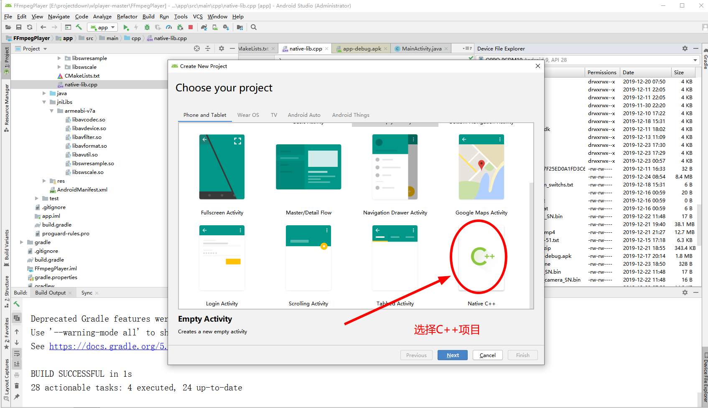
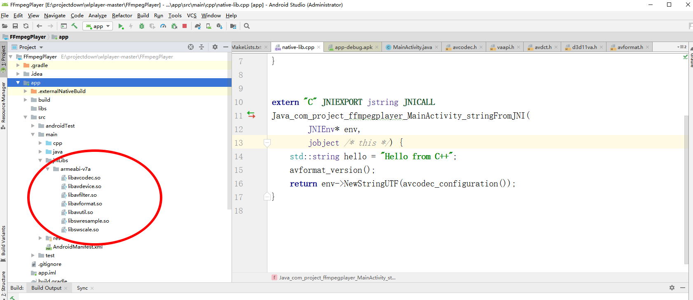

#### 1. 新建项目

##### 1. 首先新建一个工程，并且勾选 Include C++ Support 即可得到一个基于CMake的模板工程。



##### 2. 将编译FFmpeg生成的头文件和动态库分别拷贝到app/src/main/jniLibs   app/src/main/cpp/include目录下，拷贝完后的目录结构如下所示



##### 3. 配置build.gradle

在app目录下的build.gradle文件中，android节点下的defaultConfig节点下添加


```
   defaultConfig {
        applicationId "com.project.ffmpegplayer"
        minSdkVersion 15
        targetSdkVersion 29
        versionCode 1
        versionName "1.0"
        testInstrumentationRunner "androidx.test.runner.AndroidJUnitRunner"
        externalNativeBuild {
            cmake {
                cppFlags "-frtti -fexceptions"
                abiFilters 'armeabi-v7a'
            }
        }

        sourceSets {
            main {
                jniLibs.srcDirs = ['src/main/jniLibs']
            }
        }
    }
```


##### 4. 配置CMakeLists.txt文件

```
cmake_minimum_required(VERSION 3.4.1)
include_directories(include)
add_library(
             native-lib
             SHARED
             native-lib.cpp )

#添加libavcodec.so
add_library( avcodec
        SHARED
        IMPORTED)
set_target_properties( avcodec
        PROPERTIES IMPORTED_LOCATION
        ${CMAKE_SOURCE_DIR}/../../main/jniLibs/${ANDROID_ABI}/libavcodec.so)

#添加libavdevice.so
add_library(avdevice
        SHARED
        IMPORTED)
set_target_properties( avdevice
        PROPERTIES IMPORTED_LOCATION
        ${CMAKE_SOURCE_DIR}/../../main/jniLibs/${ANDROID_ABI}/libavdevice.so)

add_library( avfilter
        SHARED
        IMPORTED)
set_target_properties( avfilter
        PROPERTIES IMPORTED_LOCATION
        ${CMAKE_SOURCE_DIR}/../../main/jniLibs/${ANDROID_ABI}/libavfilter.so)

add_library( avformat
        SHARED
        IMPORTED)
set_target_properties( avformat
        PROPERTIES IMPORTED_LOCATION
        ${CMAKE_SOURCE_DIR}/../../main/jniLibs/${ANDROID_ABI}/libavformat.so)

add_library( avutil
        SHARED
        IMPORTED)
set_target_properties( avutil
        PROPERTIES IMPORTED_LOCATION
        ${CMAKE_SOURCE_DIR}/../../main/jniLibs/${ANDROID_ABI}/libavutil.so)

add_library( swresample
        SHARED
        IMPORTED)
set_target_properties( swresample
        PROPERTIES IMPORTED_LOCATION
        ${CMAKE_SOURCE_DIR}/../../main/jniLibs/${ANDROID_ABI}/libswresample.so)

add_library( swscale
        SHARED
        IMPORTED)
set_target_properties( swscale
        PROPERTIES IMPORTED_LOCATION
        ${CMAKE_SOURCE_DIR}/../../main/jniLibs/${ANDROID_ABI}/libswscale.so)


find_library(
              log-lib
              log )
target_link_libraries(
                       native-lib
                        avcodec
                        avdevice
                        avfilter
                        avformat
                        avutil
                        swresample
                        swscale
                       ${log-lib} )
```

##### 5  编写测试代码(头文件一定要用extern 包含住)

```
#include <jni.h>
#include <string>
extern  "C"
{
#include "include/libavcodec/avcodec.h"
#include "include/libavformat/avformat.h"
}


extern "C" JNIEXPORT jstring JNICALL
Java_com_project_ffmpegplayer_MainActivity_stringFromJNI(
        JNIEnv* env,
        jobject /* this */) {
    std::string hello = "Hello from C++";
    avformat_version();
    return env->NewStringUTF(avcodec_configuration());
}

```

