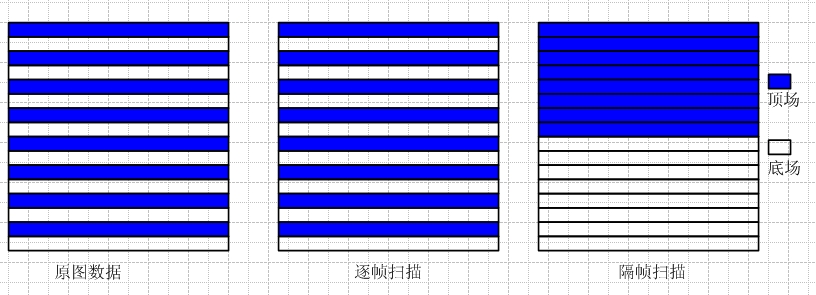
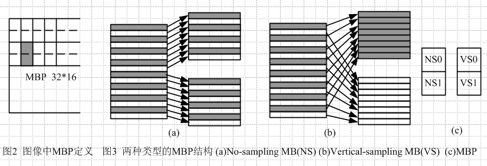
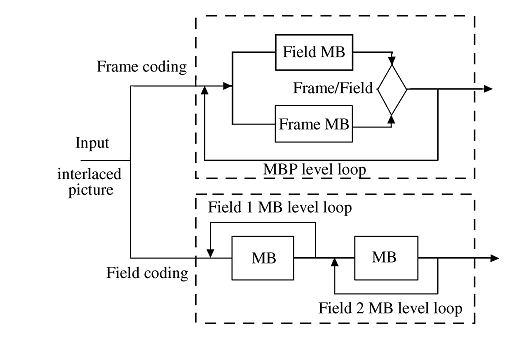
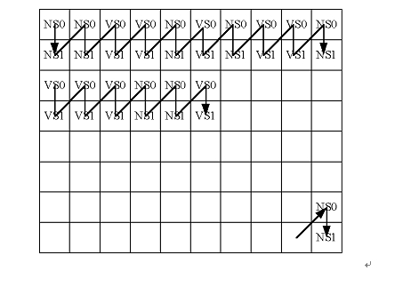

#### 帧和场的概念

**一、何谓场？**

​		每个电视帧都是通过扫描屏幕两次而产生的，第二个扫描的线条刚好填满第一次扫描所留下的缝隙。每个扫描即称为一个场。因此 **25 帧/秒**的电视画面实际上为 **50 场/秒** 

​		若要取得包含最大细节的帧，您需要合并两个场内的信息。截至目前为止，这些观念都很简单，不过若考虑到动态画面，就不是那么容易了。因为摄像机将依次地扫描这两个场， 这将有助于电视画面的动作更为顺畅，不过这也是场在编辑时所会造成的困扰。

**二、计算机与电视**

当计算机在显示器上播放视频时，它只会显示一系列完整的帧，而不使用交错场的电视技巧。因此针对计算机显示器所设计的视频格式和 MPEG-1 都不使用场。专为这些格式设计的视频编辑软件就无法正确地处理场，因此不适合产生用于电视的视频。若您的影片将通过电视来播放，务必使用可处理场的编辑程序。

 

一、概述

原始视频帧（最原始的视频数据）根据编码的需要，以不同的方式进行扫描产生两种视频帧：连续或隔行视频帧，隔行视频帧包括顶场和底场，连续（遂行）扫描的视频帧与隔行扫描视频帧有着不同的特性和编码特征，产生了所谓的帧编码和场编码。一般情况下，遂行帧进行帧编码，隔行帧可在帧编码和场编码间选取。

帧、场的 临近行相关性并不相同。 帧的临近行相关性强，实践相关性弱，因为某行的临近行(下一行)要一场扫描完才能被扫描，因此在压缩静止图像或运动量不大的图像时采用帧编码方式。场的临近行时间相关性强，空间相关性差，因为场的一行扫描完毕，接着对场中下一行扫描，因此对运动量大的图像采用场编码方式，实际的视频图像有快有慢，有粗有细，应根据这个标准自适应选择帧/场编码方式。

 

 

在帧编码中，参考为帧图像，采用帧运动补偿，两个场是联合编码，；在场编码中，参考为场图像，两个场是分别编码，采用场运动补偿。

##### 二、 视频序列帧、场编码方式 

1. 固定帧编码(全帧)----视频序列的全部帧始终采用帧编码方式。

2. 固定场编码（全场）

      1    视频序列中帧被分成两个场独立编码。编码规则：

      2    I帧可编码成两个I场或一个I场和一个P场，即II、IP.

      3    P帧可编码成两个P场或一个P场和一个B场，即PP、PB.

      4    B帧可编码成两个B场，即BB.

3. 图像级帧、场自适应编码 (PAFF)

   视频序列能被编码成一个帧或两个场，自适应选择原则是根据采用该种编码方式的每一帧的RD值。

4. 宏块级帧、场自适应（MBAFF）

   为了进一步提高编码效率，采用了宏块级帧场自适应.,宏块级采用了宏块对（MBP）为基本编码单元（如图2所示）

 

 

​    H.264采用的MBAFF方案：

 

在图像中运动比较大的地方采用场编码，运动比较小的地方采用帧编码，编码顺序例子如下：

 