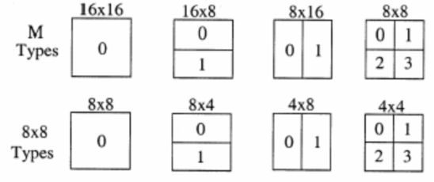
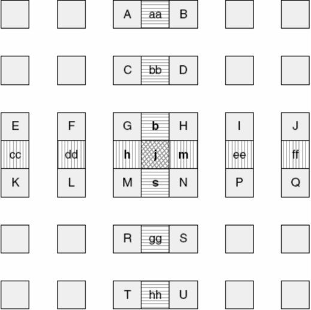
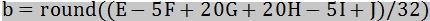
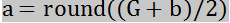
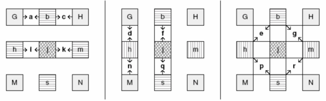
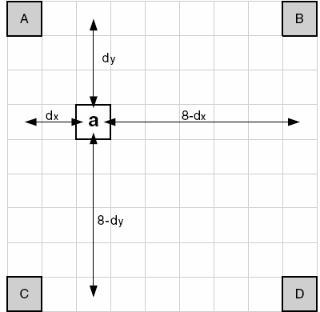
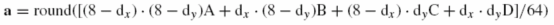
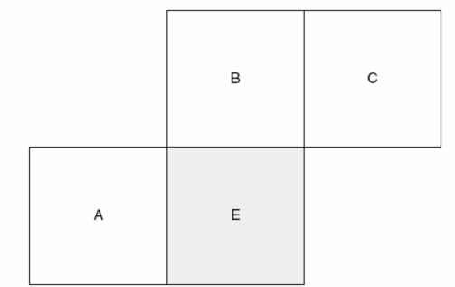
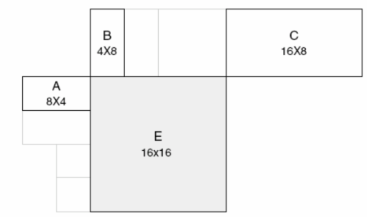
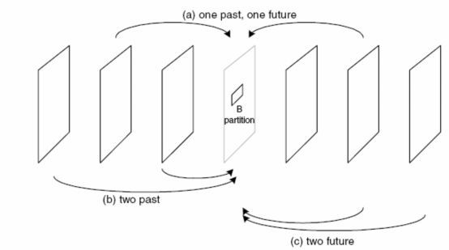

### H264基础02(帧间预测)

> 前面我们学习了帧内预测
>
> 相信大家已经都了解
>
> 今天
>
> 让我们一起来看帧间预测
>
> 是怎么一回事呢？

H.264 帧间预测是利用已编码视频帧/场和基于块的运动补偿的预测模式。与以往标准帧间预测的区别在于块尺寸范围更广（从16×16 到4×4）、亚像素运动矢量的使用（亮度采用1/4 像素精度MV）及多参考帧的运用等等。

**树状结构运动补偿**

每个宏块（16×16 像素）可以4 种方式分割：一个16×16，两个16×8，两个8×16，四个8×8。其运动补偿也相应有四种。而8×8 模式的每个子宏块还可以四种方式分割：一个8×8，两个4×8 或两个8×4 及4 个4×4。这些分割和子宏块大大提高了各宏块之间的关联性。这种分割下的运动补偿则称为树状结构运动补偿。

每个分割或子宏块都有一个**独立的运动补偿**。每个MV 必须被编码、传输，分割的选择也需编码到压缩比特流中。对大的分割尺寸而言，MV 选择和分割类型只需少量的比特，但运动补偿残差在多细节区域能量将非常高。小尺寸分割运动补偿残差能量低，但需要较多的比特表征MV 和分割选择。分割尺寸的选择影响了压缩性能。整体而言，大的分割尺寸适合平坦区域，而小尺寸适合多细节区域。

宏块的色度成分（Cr 和Cb）则为相应亮度的一半（水平和垂直各一半）。色度块采用和亮度块同样的分割模式，只是尺寸减半（水平和垂直方向都减半）。例如，8×16 的亮度块相应色度块尺寸为4×8，8×4 亮度块相应色度块尺寸为4×2 等等。色度块的MV 也是通过相应亮度MV 水平和垂直分量减半而得。

**运动矢量**

帧间编码宏块的每个分割或者子宏块都是从参考图像某一相同尺寸区域预测而得。两者之间的差异（MV）对亮度成分采用1/4 像素精度，色度1/8 像素精度。亚像素位置的亮度和色度像素并不存在于参考图像中，需利用邻近已编码点进行内插而得。图6.6.3 中，当前帧的4×4 块通过邻近参考图像相应区域预测。如果MV 的垂直和水平分量为整数，参考块相应像素实际存在（灰色点）。如果其中一个或两个为分数，预测像素（灰色点）通过参考帧中相应像素（白色点）内插获得。

内插像素生成：

首先生成参考图像亮度成分半像素像素。半像素点（如b,h,m）通过对相应整像素点进行6 抽头滤波得出，权重为（1/32 ,-5/32 ,5/8, 5/8, -5/32, 1/32）。b 计算如下：

类似的，h 由A、C、G、M、R、T 滤波得出。一旦邻近（垂直或水平方向）整像素点的所有像素都计算出，剩余的半像素点便可以通过对6 个垂直或水平方向的半像素点滤波而得。例如，j 由cc, dd, h,m,ee,ff 滤波得出。这里说明的是，6 抽头滤器比较复杂，但可明显改善运动补偿性能。

半像素点计算出来以后，1/4 像素点就可通过线性内插得出，如下图所示。1/4 像素点（如a,c, i, k, d, f, n, q）由邻近像素内插而得，如

剩余1/4 像素点（p, r）由一对对角半像素点线性内插得出。如，e 由b 和h 获得。

相应地，色度像素需要1/8 精度地MV，也同样通过整像素地线性内插得出，如下图所示。

当dx＝2，dy＝3 时，

**MV预测**

每个分割MV 的编码需要相当数目的比特，特别是使用小分割尺寸时。为减少传输比特数，可利用邻近分割的MV 较强的相关性，MV 可由邻近已编码分割的MV 预测而得。预测矢量MVp 基已计算MV 和MVD（预测与当前的差异）并被编码和传送。MVp 则取决于运动补偿尺寸和邻近MV 的有无。

E为当前宏块或宏块分割子宏块。A、B、C 分别为E 的左、上、右上方的三个相对应块。

如果E 的左边不止一个分割，取其中最上的一个为A；上方不止一个分割时，取最左边一个为B。图显示所有分割有相同尺寸时的邻近分割选择。下图给出了不同尺寸时临近分割的选择。 

**B  片预测**

B片中的帧间编码宏块的每个子块都是由一个或两个参考图像预测而得。该参考图像在当前图像的前面或者后面。参考图像存储于编解码器中，其选择有多种方式。下图显示了三种方式：一个前向和一个后向的（类似于MPEG 的B 图像预测）；两个前向；两个后向。

参考图像

B 片用到了两个已编码图像列表：list0 和list1，包括短期和长期图像两种。这两个列表都可包含前向和后向的已编码图像（按显示顺序排列）。其中，

List0：最近前向图像（基于POC）标为index0，接着是其余前向图像（POC 递增顺序），及后向图像（从当前图像POC 递增顺序）。

List1：最近后向图像标为index0，接着是其余后向图像（POC 递增顺序），及前向图像（从当前图像POC 递增顺序）。

举例：一个H.264 解码器存储了6 幅短期参考图像。其POC 分别为：123，125，126，128，129 和130。当前图像为127。所有6 幅短期参考图像在list0 和list1 中都标为“用作参考”，如下表所示。

预测模式选择

B片的预测方式包括：宏块分割方式、双向选择方式、参考列表选择方式等等。具体说，B 片中宏块分割可由多种预测方式中的一种实现，如直接模式、利用list0 的运动补偿模式、利用list1 的运动补偿模式或者利用list0 和list1 的双向运动补偿模式。每个分割可选择各自的不同的预测模式（如下表所示）。如果8×8 分割被使用，每个8×8 分割所选则的模式适用于分割中的所有亚分割。下图给出了例子，左边的两个16×8 分割分别使用List0 和双向预测模式，而右边的4 个8×8 分割分别采用直接、list0、list1 和双向预测四种模式。

| 分割      | 选 择                                        |
| :-------- | :------------------------------------------- |
| 16×16     | 直接、list0、list1、双向                     |
| 16×8/8×16 | list0、list1、双向（每个分割独立选择）       |
| 8×8       | 直接、list0、list1、双向（每个分割独立选择） |

双向预测

双向预测中，参考块（与当前分割或亚分割同尺寸）是由list0 和list1 的参考图像推出的。从list0和list1 分别得出两个运动补偿参考区域（需要两个MV），而预测块的像素取list0 和list1 相应像素的平均值。当不用加权预测时，用下列等式：

其中，pred0(i,j)和pred1(i,j)为由list0 和list1 参考帧推出的预测像素，pred(i,j)为双向预测像素。计算出每个预测像素后，运动补偿残差通过当前宏块像素减pred(i,j)而得。举例：一宏块用B_Bi_16×16 模式预测。下图分别给出了基于list0 和list1 参考图像的运动补偿参考区域。以及根据者两个参考区域的双向预测。

直接预测

直接预测模式编码的B片宏块或宏块分割不传送MV。相反，解码器计算基于已编码MV 的list0和list1MV 并计算出解码残差像素的双向预测运动补偿。B 片中的skipped 宏块便由解码器用直接模式重建而得。

片头会指明将用时间还是空间方式计算直接模式或其分割的矢量。在空间模式中，list0 和list1 预测矢量计算如下：

如果第一幅list1 参考图像的co-located MB 或分割有一个MV 幅度上小于±1/2 亮度像素，其一个或两个预测矢量置为0；否则预测list0 和list1 矢量用以计算双向运动补偿。

在时间模式中，计算步骤如下：

1） 找出 list1 图像co-located MB 或分割相应的list0 参考图像。该list0 参考作为当前MB 或分割的list0 参考；

2） 找出 list1 图像co-located MB 或分割相应的list0MV；

3） 计算当前图像和 list1 图像的POC 的MV，作为新的list1 MV1；

4） 计算当前图像和 list0 图像的POC 的MV，作为新的list0 MV0。

这些模式在预测参考宏块或分割不提供或帧内编码等情况下需作出调整。举例：当前宏块list1 参考在当前帧两幅图像后出现，如下图所示。List1 参考co-located MB有一MV（+2.5，+5），指向list0 参考图像（出现于当前图像3 幅图像前）。解码器分别计算指向list1

和list0 的MV1（-1，-2）和MV0（+1.5，+3）。

加权预测

加权预测是一种用来修正 P 或B 片中运动补偿预测像素方法。H.264 中由3 中加权预测

类型：

1） P 片宏块“explicit”加权预测；

2） B 片宏块“explicit”加权预测；

3） B 片宏块“implicit”加权预测；

每个预测像素pred0(i,j)和pred1(i,j)在运动补偿之前通过加权系数ω0 和ω1 修正。在“explicit”类型中，加权系数由编码器决定并在片头中传输。在“implicit”类型中，系数ω0 和ω1 由相应list0 和list1 参考图像的时间位置推出。大的系数用于时间上接近当前图像的情况，小的则用于时间上远离当前图像的情况。

可见，H.264 采用树状结构的运动补偿技术，提高了预测能力。特别是，小块预测提高了模型处理更好的运动能够描述的能力，产生更好的图像质量。H.264 运动向量的精度提高到1/4 像素（亮度），运动补偿算法的预测能力得到进一步提高。H.264 还提供多参考帧可选模式，，这将产生更好的视频质量和效率更高的视频编码。相对于1 帧参考，5 个参考帧可以节约5%~10%的比特率，且有助于比特流的恢复。当然，并不是说参考帧越多越好，经实验，考虑到缓冲区的能力和编码器的效率，目前一般都选取3~5 个参考帧

怎么样

帧间预测和帧内预测有何不同

你都了解了吗